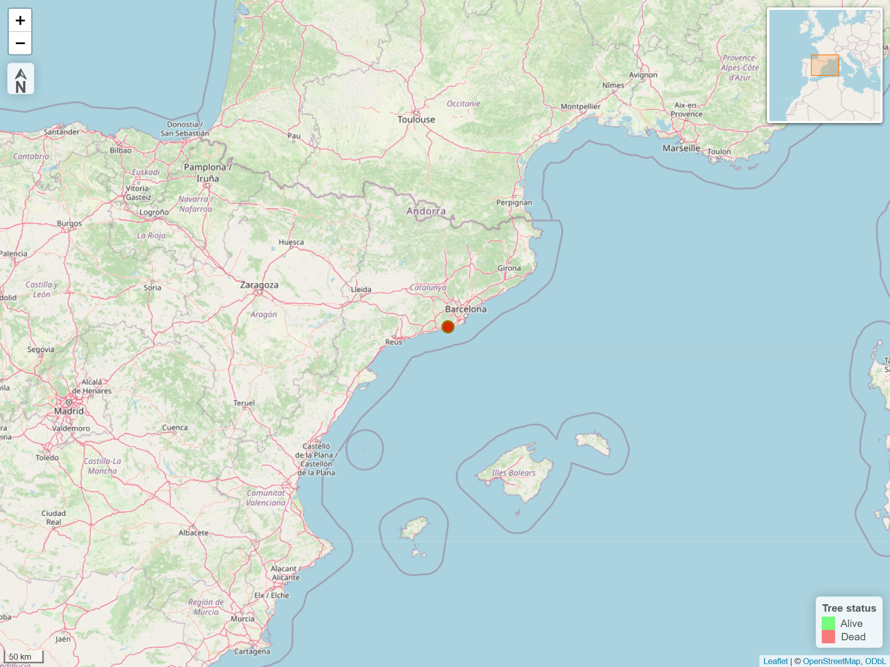

```{r setup, include=FALSE, message=FALSE, warning=FALSE}
knitr::opts_chunk$set(echo = FALSE)
library(tinytex)
```

## Introduction

In recent decades, drought-driven tree mortality has become widespread, particularly in ***Mediterranean ecosystems*** [@lemus-canovas2024], where prolonged drought accelerates forest-to-shrubland transitions [@coughlandeperez2022]. Detecting **early-warning signals** of tree decline is therefore essential for anticipating ecosystem changes and guiding conservation.

We investigated massive 2023 mortality event in Aleppo pine (*Pinus halepensis*) at the Garraf Massif (NE Iberian Peninsula).


This episode of drought-driven tree mortality from 2023 was reported in the [Catalan news](https://www.3cat.cat/3catinfo/boscos-que-moren-per-la-sequera-el-garraf-mes-a-prop-de-ser-un-paisatge-semidesertic/noticia/3276618/). Despite the rains of recent months, the effects of the drought remain [visible](https://www.3cat.cat/3catinfo/les-dues-cares-del-garraf-esplendor-per-les-pluges-pero-reducte-duna-sequera-persistent/noticia/3354963/).

# Climatic data

Climatic data were obtained from the meteorological station at El Prat Airport, which has recorded weather variables since 1950 [@prohom2023]. These are the trends of temperature and precipitation for the period 1950-2022.kajsdhkajsd

```{r, message=FALSE}
library(dplyr)
library(ggplot2)


data <- read.csv("data/aeroport_del_prat1.csv", sep = ";")

# Calcular la precipitació mitjana anual
dades_anuals_precip <- data %>%
  group_by(Year) %>%
  summarise(Precipitacio_Mitjana_Anual = sum(RR, na.rm = TRUE), .groups = "drop")

# Ajustem una regressió lineal per la precipitació mitjana anual
model_precip <- lm(Precipitacio_Mitjana_Anual ~ Year, data = dades_anuals_precip)

# Extreure R² i p-value del model de regressió
resum_model_precip <- summary(model_precip)
R2_precip <- round(resum_model_precip$r.squared, 3)
p_value_precip <- formatC(resum_model_precip$coefficients[2, 4], format = "e", digits = 4)

# Funció per convertir el p-valor en asteriscs
get_significance_stars <- function(p) {
  if (p < 0.001) {
    return("***")
  } else if (p < 0.01) {
    return("**")
  } else if (p < 0.05) {
    return("*")
  } else {
    return("ns")  # Text per a p ≥ 0.05
  }
}

# Obtenir els asteriscs segons el p-valor
p_stars <- get_significance_stars(as.numeric(p_value_precip))

# Extreure els coeficients del model (intercept i pendent)
coeficients <- coef(model_precip)
intercept <- round(coeficients[1], 2)
pendent <- round(coeficients[2], 2)

# Crear el text de l'equació en format y = mx + b
equacio_text <- paste0("y = ", pendent, "x + ", intercept)

# Crear el text de l'etiqueta
subtitle_text <- paste0(equacio_text,
                        "   |   R² = ", R2_precip,
                        "   ", p_stars)
# Crear el gràfic per la precipitació mitjana anual

pre<-ggplot(dades_anuals_precip, aes(x = Year, y = Precipitacio_Mitjana_Anual)) +
  geom_line(color = "blue") +
  scale_x_continuous(limits = c(1950, 2023), breaks = scales::breaks_width(10)) +
  scale_y_continuous()+#breaks = scales::breaks_width(10)) + 
  geom_smooth(method = "lm", color = "red", formula= y ~ x, linetype=2, se = FALSE) +
  labs(title = "Precipitation trend at Aeroport del Prat (1950-2023)",
       subtitle = subtitle_text,
       x = "Time (Year)",
       y = "Precipitation (mm)") +
  theme_classic(base_family = "serif")

pre
```

# DBH by status

```{r}
library(readxl)
library(ggplot2)
data <- read_xlsx("data/garraf_01_08_2024.xlsx")

ggplot(data, aes(x = STATUS, y = `DBH corrected (mm)`)) +
  geom_boxplot(fill = NA, color = "black") +
  geom_jitter(width = 0.15, size = 2, alpha = 0.7) +
  labs(
    x = "status",
    y = "DBH (cm)",
    title = "DBH by status"
  ) +
  theme_minimal()
```

# Site map
```{r mapa_pdf, eval=!knitr::is_html_output(), results= "hide", echo=FALSE, warning=FALSE, message=FALSE, out.width='100%'}
library(dplyr)
library(sf)
library(leaflet)
library(gpx)
library(htmltools)
library(htmlwidgets)
library(webshot)

#chunk per generar el mapa, ho separo en dos pq així no surti un missatge ##NULL
# Dades (mateix codi)
gpx <- read_gpx("data/waypoints_garraf.gpx")
waypoints <- as_tibble(gpx$waypoints) %>% 
  slice(-c(10, 11)) %>% 
  rename(GPS = Name) %>% 
  mutate(GPS = as.numeric(GPS))

data <- data %>%
  mutate(GPS = as.numeric(sub("-.*", "", GPS)))

data_waypoints <- waypoints %>% 
  left_join(data, by = "GPS") %>% 
  select(Elevation, Latitude, Longitude, GPS, STATUS) %>%
  mutate(STATUS = factor(STATUS, levels = c("A", "D"), labels = c("Alive", "Dead")))

pal <- colorFactor(palette = c("green", "red"), domain = data_waypoints$STATUS)

north_arrow <- HTML('
<div style="width: 20px; height: 30px; text-align: center; font-weight: bold; font-size: 22px;">
  <div>⮙</div>
  <div>N</div>
</div>')

# Crea el mapa
map <- leaflet(data = data_waypoints) %>%
  addProviderTiles(providers$Esri.WorldImagery) %>%
  setView(lng = 1.8677, lat = 41.19, zoom = 7) %>% 
  addCircleMarkers(lng = ~Longitude, lat = ~Latitude,
                   color = ~pal(STATUS), fillColor = ~pal(STATUS),
                   fillOpacity = 0.8, radius = 6,
                   popup = ~paste("GPS:", GPS, "<br>Status:", STATUS)) %>%
  addMiniMap(position = "topright", width = 150, height = 150) %>% 
  addLegend("bottomright", pal = pal, values = ~STATUS, title = "Tree status") %>%
  addScaleBar(position = "bottomright", options = scaleBarOptions(imperial = FALSE)) %>%
  addControl(north_arrow, position = "topleft")

# GENERA LA IMATGE ESTÀTICA (serveix per a què al pdf quedi la imatge estàtica)
saveWidget(map, "mapa.html", selfcontained = TRUE)
webshot("mapa.html", "mapa_arbre.png", vwidth = 1200, vheight = 900, zoom = 1.5)

# MOSTRA LA IMATGE AL PDF


```

```{r mapa_pdf_show, eval=!knitr::is_html_output(), echo=FALSE, out.width="100%"}

```

```{r mapa_interactiu, eval=knitr::is_html_output(), echo=FALSE, warning=FALSE, message=FALSE}
library(dplyr)
library(leaflet)
library(gpx)
library(htmltools)
gpx <- read_gpx("data/waypoints_garraf.gpx")
waypoints <- as_tibble(gpx$waypoints) %>% 
  slice(-c(10, 11)) %>% 
  rename(GPS = Name) %>% 
  mutate(GPS = as.numeric(GPS))

data <- data %>%
  mutate(GPS = as.numeric(sub("-.*", "", GPS)))

data_waypoints <- waypoints %>% 
  left_join(data, by = "GPS") %>% 
  select(Elevation, Latitude, Longitude, GPS, STATUS) %>%
  mutate(STATUS = factor(STATUS, levels = c("A", "D"), labels = c("Alive", "Dead")))

pal <- colorFactor(palette = c("green", "red"), domain = data_waypoints$STATUS)

north_arrow <- HTML('
<div style="width: 20px; height: 30px; text-align: center; font-weight: bold; font-size: 22px;">
  <div>⮙</div>
  <div>N</div>
</div>')

leaflet(data = data_waypoints) %>%
  addProviderTiles(providers$Esri.WorldImagery) %>%
  setView(lng = 1.8677, lat = 41.19, zoom = 7) %>% 
  addCircleMarkers(lng = ~Longitude, lat = ~Latitude,
                   color = ~pal(STATUS), fillColor = ~pal(STATUS),
                   fillOpacity = 0.8, radius = 6,
                   popup = ~paste("GPS:", GPS, "<br>Status:", STATUS)) %>%
  addMiniMap(position = "topright", width = 150, height = 150) %>% 
  addLegend("bottomright", pal = pal, values = ~STATUS, title = "Tree status") %>%
  addScaleBar(position = "bottomright", options = scaleBarOptions(imperial = FALSE)) %>%
  addControl(north_arrow, position = "topleft")
```
```{r taula_waypoints, echo=FALSE}
knitr::kable(data_waypoints,
             col.names = c('Elevation', 'Latitude', 'Longitude', 'GPS', 'status'),
             align = "c",
             caption = "Table 1. Tree waypoints by status")
```
\newpage

## Bibliography
